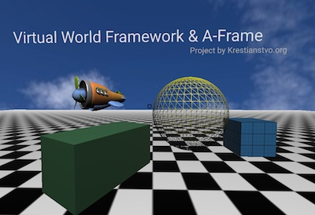

# LiveCoding.space

?> Collaborative Live Coding Space with support of user-defined languages and **WebVR** ready 3D graphics
Based on: **Virtual World Framework** | **A-Frame** | **Ohm language** | **OSC.js** | **Cell.js** | **GunDB** and more...

!> Online at: **[https://livecoding.space](https://livecoding.space)**

